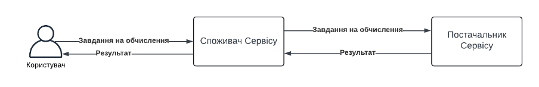

-	Реалізувати синхронну комунікація між 2ма сервісами. Cпоживач Cервісу генерує завдання на обчислення і чекає відповіді від Постачальник Сервісу.
-	Постачальник Сервісу має підраховувати час обчислення і логувати його для подальшого аналізу
-	Cпоживач Cервісу має підраховувати час виконання запиту і логувати його для подальшого аналізу
