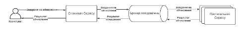

-	Реалізувати асинхронну комунікацію між Постачальником Сервісу і Споживачем Сервісу за допомогою Брокера Повідомлень
-	Постачальник Сервісу має підраховувати час обчислення і логувати його для подальшого аналізу
-	Cпоживач Cервісу має підраховувати час виконання запиту і логувати його для подальшого аналізу
-	Реалізувати горизонтальне масштабування засобами Брокера Повідомлень
-	Порівняти результати синхронної і асинхронної комунікації 
-	Опціонально: Реалізувати request-reply паттерн в асинхронній комунікації
